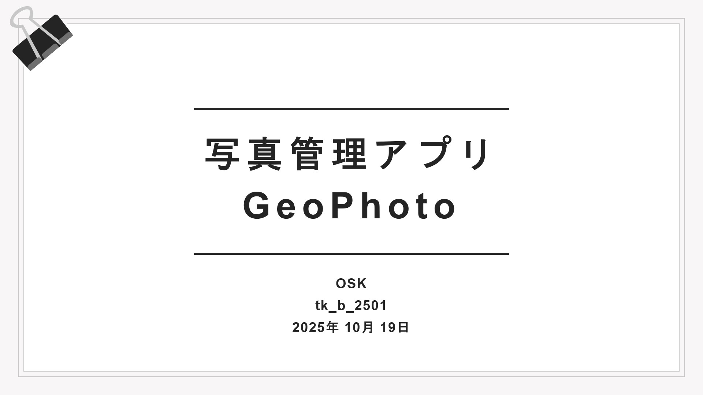
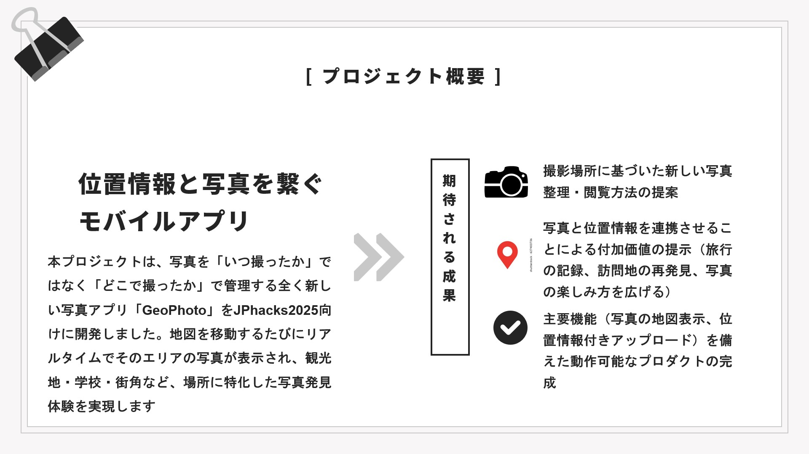
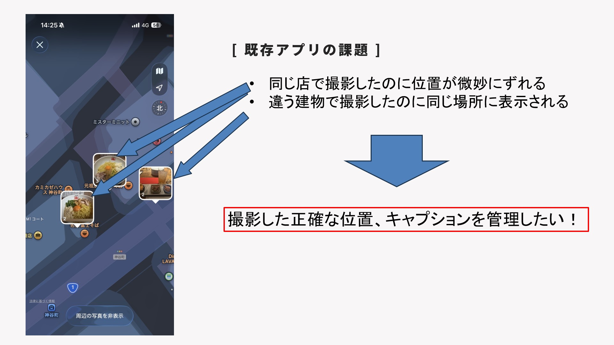
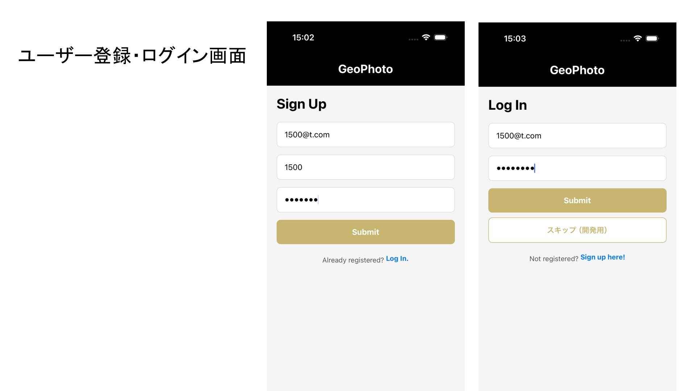
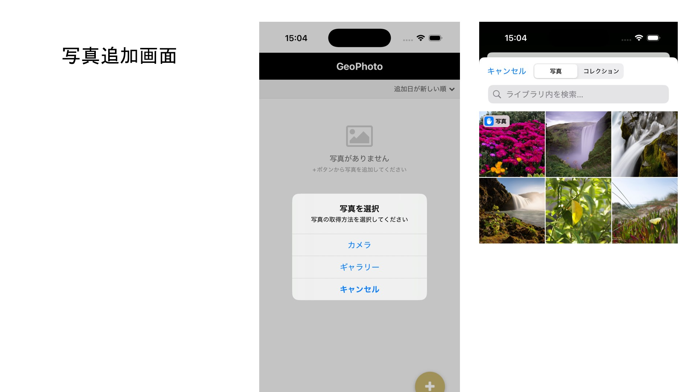
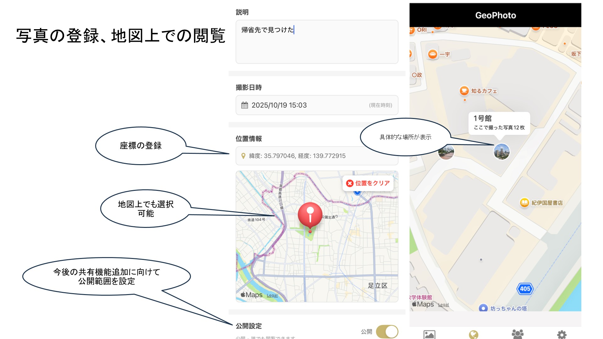
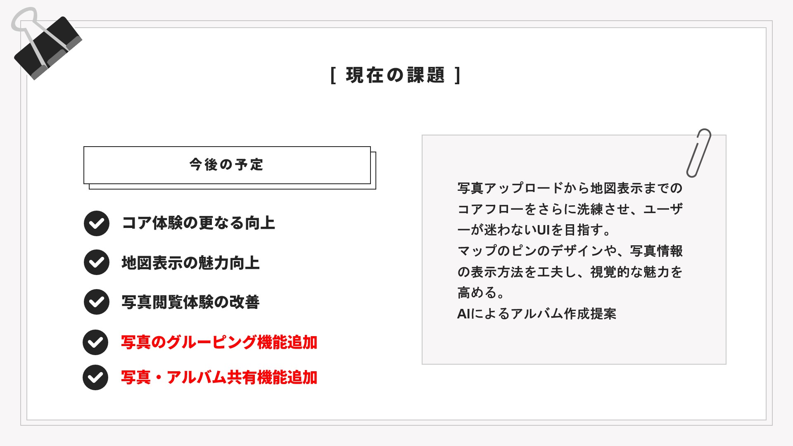

# GeoPhoto
<p align="center">
  
</p>

本プロジェクトは、写真を「いつ撮ったか」ではなく「どこで撮ったか」で管理する全く新しい写真アプリ「GeoPhoto」をJPhacks2025向けに開発しました。地図を移動するたびにリアルタイムでそのエリアの写真が表示され、観光地・学校・街角など、場所に特化した写真発見体験を実現します

## ユーザーのターゲット

**【生物・環境系の学生や研究者】**  
- 現地調査で撮影した生物・植物・地形などの記録を、位置情報付きで整理。

**【フィールドワークを行う技術者や測量担当者】**  
- 写真と座標を紐づけて現場データを効率的に共有。

**【写真・風景・旅行好きの一般ユーザー】**  
- 撮影地を地図で振り返ったり、旅の記録を位置ベースで保存。

---

**活用イメージ**
- 研究現場での「サンプル採取地点の記録管理」  
- フィールド調査での「位置付き写真ログ」  
- 趣味写真の「マップギャラリー化（自分専用の撮影地マップ）」

  

<table>
  <tr>
    <td></td>
    <td></td>
  </tr>
  <tr>
    <td></td>
    <td></td>
  </tr>
  <tr>
    <td></td>
    <td></td>
  </tr>
  <tr>
    <td></td>
    <td></td>
  </tr>
</table>

## デモ動画
 [デモ動画を見る（YouTube）](https://www.youtube.com/shorts/7-CzCNS0vtg)


## プロジェクト構成

```
tk_b_2501/
├── frontend/          # React Native iOSアプリ
│   ├── App.tsx
│   ├── package.json
│   └── ...
├── backend/           # FastAPI バックエンド
│   ├── main.py
│   ├── requirements.txt
│   └── ...
├── docker-compose.yml # Docker環境設定
└── SETUP.md          # セットアップガイド
```

## 技術スタック

### フロントエンド
- **React Native** 0.72.6
- **TypeScript**
- **React Navigation**

### バックエンド
- **FastAPI** 0.104.1
- **SQLAlchemy** (ORM)
- **PostgreSQL** (データベース)


### インフラ
- **Docker** & **Docker Compose**
- **PostgreSQL** (コンテナ)

## クイックスタート

### 1. 環境セットアップ
詳細は [SETUP.md](./SETUP.md) を参照してください。

### 2. 開発サーバー起動
```bash
# Docker環境を起動
docker-compose up -d

# フロントエンド（別ターミナル）
cd frontend
npm install
npm start

# iOSアプリ起動（Mac環境のみ）
npm run ios

# バックエンド（別ターミナル）
cd backend
pip install -r requirements.txt
uvicorn main:app --reload
```

### 3. アクセス
- **iOSアプリ**: iOSシミュレーターで起動
- **API**: http://localhost:8000
- **API Docs**: http://localhost:8000/docs

## 開発環境

- **Windows 11**: 開発環境
- **Mac**: iOS開発環境

## 主要機能

- ユーザー管理API
- データベース連携
- クロスプラットフォーム対応（予定※現在iOS版のみ）


##  ER図


---

```mermaid
erDiagram
    USERS ||--o{ SESSIONS : "ログインセッション"
    USERS ||--o{ PHOTOS : "写真を所有"

    USERS {
        uuid id PK "ユーザーID（主キー）"
        string email "メールアドレス（ログイン用）"
        string password_hash "パスワードハッシュ（bcrypt）"
        string username "表示名"
        datetime created_at "作成日時"
    }

    SESSIONS {
        uuid id PK "セッションID（主キー）"
        uuid user_id FK "ユーザーID（外部キー）"
        string refresh_token_hash "リフレッシュトークンのハッシュ値"
        string user_agent "アクセス元の端末情報"
        string device_name "端末名（例：iPhone 15）"
        string ip_address "接続元IPアドレス"
        datetime issued_at "発行日時"
        datetime expires_at "有効期限"
        datetime revoked_at "無効化日時（サインアウト時）"
    }

    PHOTOS {
        uuid id PK "写真ID（主キー）"
        uuid user_id FK "投稿者のユーザーID"
        string s3_key "S3上のファイルキー"
        string mime_type "画像のMIMEタイプ（例：image/jpeg）"
        bigint size_bytes "ファイルサイズ（バイト）"
        string title "写真タイトル"
        text description "写真の説明・キャプション"
        float lat "緯度"
        float lng "経度"
        geography location "位置情報（PostGIS Point）"
        float accuracy_m "位置の精度（メートル単位）"
        text address "住所（逆ジオコーディング結果）"
        jsonb exif "EXIF情報（撮影日時など）"
        enum visibility "公開範囲（private/unlisted/public）"
        datetime taken_at "撮影日時"
        datetime created_at "登録日時"
    }

